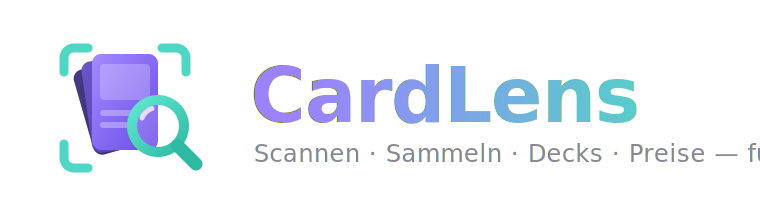
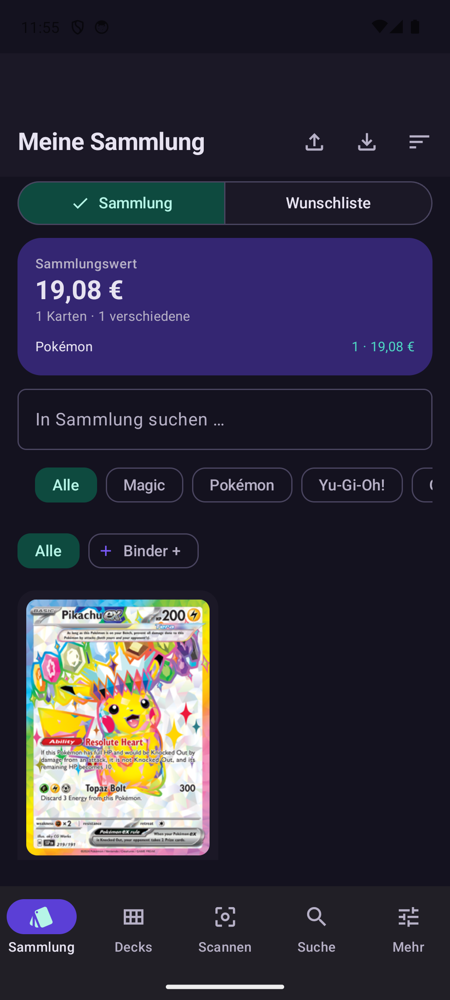
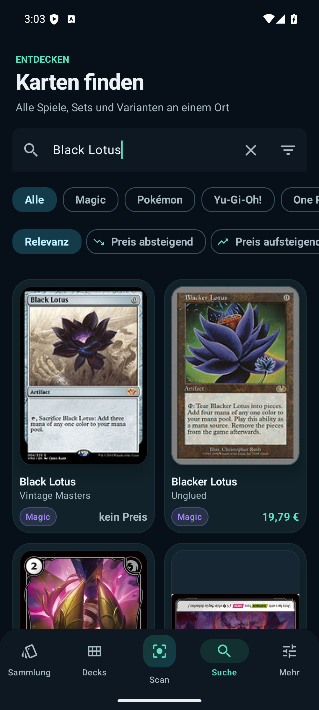
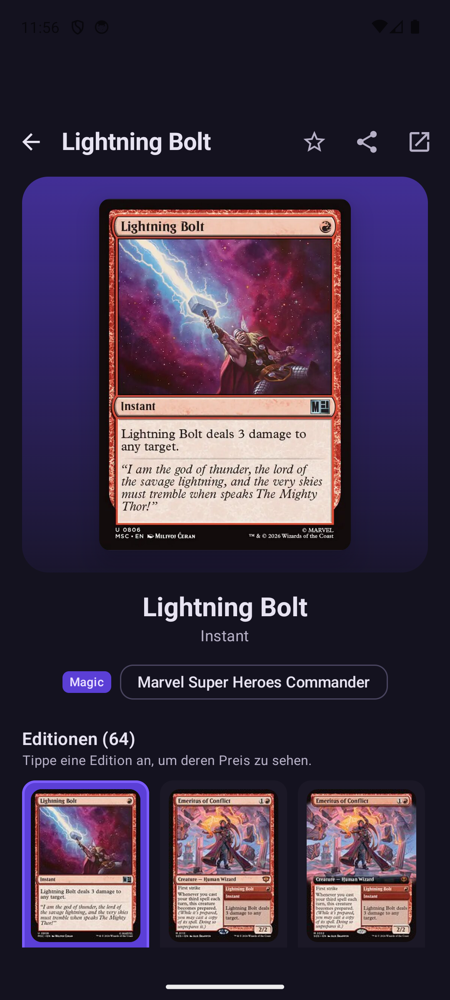
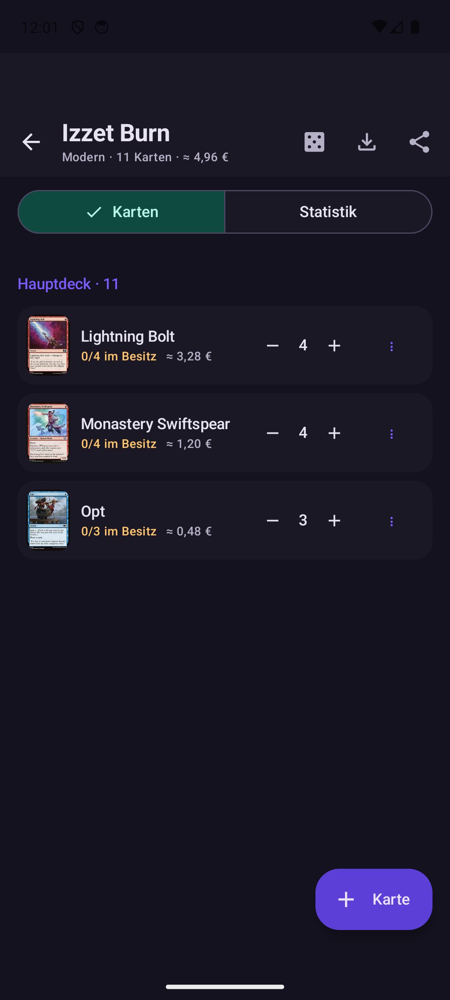
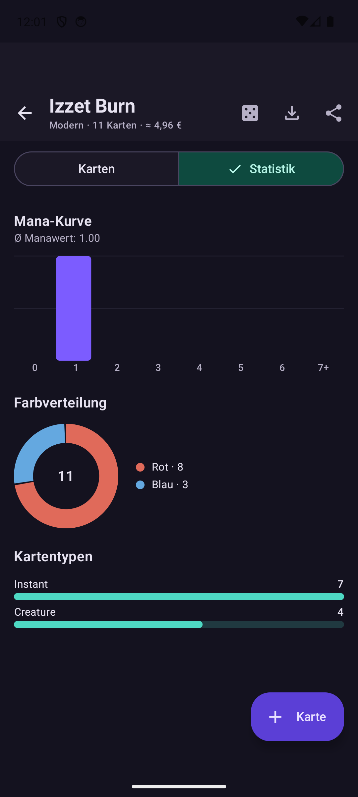
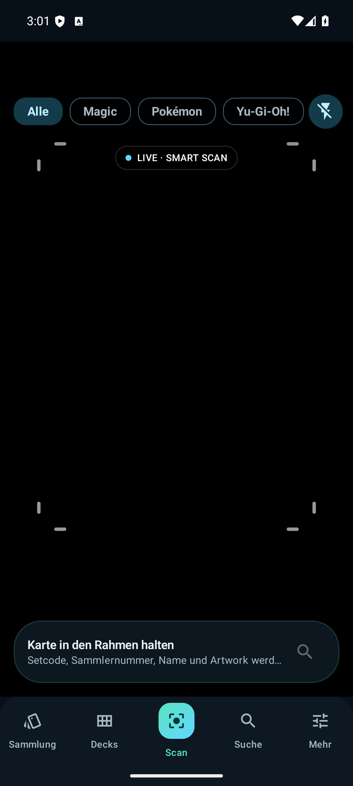
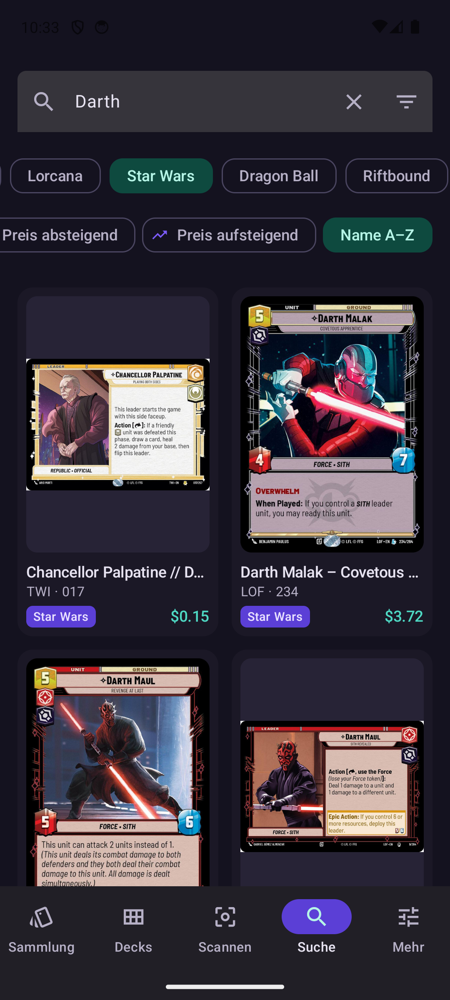
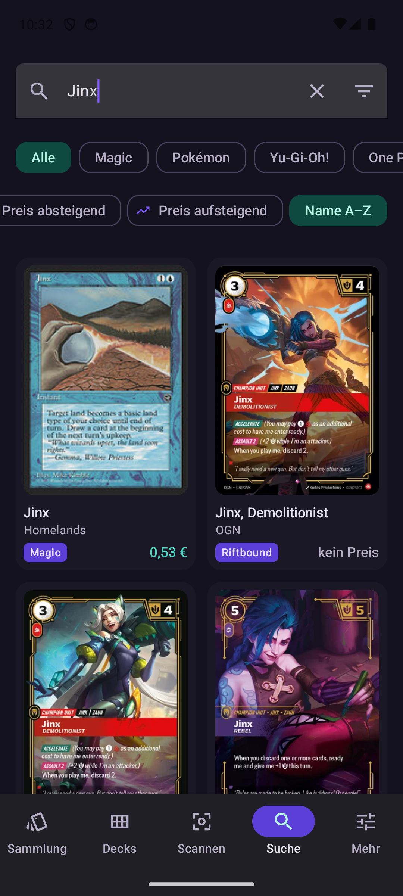

<p align="center">
  
</p>

<p align="center">
  <a href="../../releases/latest"></a>
</p>

<p align="center">
  
  
  
  
</p>

**Der komplette Sammlungs-Manager für TCG-Karten** – scannen, verwalten, Decks bauen,
tauschen und Marktpreise verfolgen. Für Magic: The Gathering, Pokémon, Yu-Gi-Oh!,
One Piece, Disney Lorcana, Star Wars: Unlimited, Dragon Ball Fusion World und Riftbound (LoL).

Native Android-App mit Kotlin und Jetpack Compose (Material 3).

## Screenshots

| Sammlung | Suche | Karten-Detail |
|:---:|:---:|:---:|
|  |  |  |

| Deck | Deck-Statistik | Scanner |
|:---:|:---:|:---:|
|  |  |  |

| Star Wars: Unlimited | Riftbound (LoL) |
|:---:|:---:|
|  |  |

## Features

### 📷 Scanner
- **Echte Kartenerkennung mit Entzerrung** – die Pipeline findet die
  physischen Kartenkanten im Suchband um den Zielrahmen (Gradienten-Analyse),
  schneidet die Karte perspektivisch korrekt auf ein kanonisches 63:88-Bild
  zu und arbeitet erst dann: OCR und Bildabgleich sehen eine *flache,
  entzerrte Karte* statt eines schiefen Kamera-Ausschnitts. Die erkannten
  Kanten werden live im Sucher angezeigt; angezeigter Rahmen und analysierter
  Bereich teilen sich exakt dieselbe Geometrie (FILL_CENTER-Mapping).
- **Identifier-first Erkennung** – On-Device-OCR (ML Kit) liest zuerst die
  aufgedruckte Druck-Kennung (Magic: Set·Nummer, Pokémon: Nummer/Setgröße,
  Yu-Gi-Oh!: Passcode & Set-Code, One Piece & Dragon Ball: Karten-ID,
  Lorcana: Nummer·Set, Star Wars: Unlimited: Set·Nummer)
  → ein API-Call, exakte Edition. Name als Fallback. Mit Kennungs-Zoom auf dem
  unteren Kartenband, Frame-Voting, Autofokus, Schwachlicht-Hinweis,
  Taschenlampe und Spiel-Filter.
- **Zwei-Signale-Regel gegen Fehlerkennungen** – automatisch erfasst wird nur,
  wenn neben der Kennung ein zweites unabhängiges Signal zustimmt: der
  OCR-Kartenname **oder** der visuelle Bildabgleich. Dazu kommen
  Plausibilitäts-Checks vor jedem Lookup (Scryfall-Set-Whitelist,
  Nummern-Bereiche) und eine Reparatur typischer OCR-Verwechsler (O↔0, I↔1 …).
  Eine Kennung muss in mindestens zwei Frames stabil sein; OCR-Name und Nummer
  aus demselben unscharfen Bild gelten bewusst nicht als unabhängige Signale.
- **Varianten-sicher statt Varianten-raten** – One-Piece-Parallelkarten,
  Dragon-Ball-Alt-Arts, Yu-Gi-Oh!-Reprints und Pokémon-Drucke können dieselbe
  Basiskennung teilen. Diese landen nur bei einem klar getrennten visuellen
  Treffer automatisch im Stapel, sonst zeigt CardLens einen begründeten
  Versionsvergleich. Foil/Normal bleibt eine bewusste Bestätigung, weil Glanz
  aus einem einzelnen Kamerabild nicht zuverlässig messbar ist.
- **Visueller Editions-Abgleich (Perceptual Hash)** – vom entzerrten
  Kartenbild wird ein Fingerabdruck (dHash + aHash, ganze Karte **und**
  Artwork-Region) berechnet und mit den Bildern der Treffer-Kandidaten
  verglichen. So gewinnt bei vielen namensgleichen Drucken (z. B. 64×
  „Lightning Bolt") die *tatsächlich gehaltene* Edition — sprach- und
  OCR-unabhängig, für **alle** TCGs.
- **Session-first wie ManaBox** – jede sicher erkannte Karte wandert sofort
  mit Haptik und grünem Blitz in den Session-Stapel, ohne den Scan-Fluss zu
  unterbrechen: unten im Tray die letzte Karte mit Edition, Preis und
  Undo, dazu laufender Gesamtwert. Bei mehrdeutigen Treffern öffnet ein
  **Editions-Wähler** statt stiller Fehlerfassung. Review-Sheet mit
  Foil-/Zustands-/Mengen-Schnelleinstellung pro Karte, Ein-Klick-Übernahme
  in die Sammlung, Duplikat-Bremse gegen Doppelerfassung.
- Standard-Zustand & -Sprache für neue Karten konfigurierbar.

### 🗂️ Sammlung
- **Varianten-genau**: Zustand (M–PO), Sprache, Foil, Altered, Fehldruck,
  Kaufpreis und Notizen pro Eintrag.
- **Binder** – Sammlung in Ordner organisieren, Karten per Bulk-Aktion verschieben.
- **Mehrfachauswahl** (Long-Press) – löschen oder in Binder verschieben.
- **Dashboard** – Gesamtwert, Kartenzahl, **Wertverlauf-Diagramm** (täglicher
  Snapshot), Aufschlüsselung nach Spiel.
- Suche in der Sammlung, Sortierung (Neueste, Name, Wert, Set, Anzahl), Spiel-Filter.
- **CSV-Export/-Import** im verbreiteten Sammlungs-Spaltenlayout (u. a.
  ManaBox-kompatibel) — inkl. Zustand, Sprache, Foil, Scryfall-ID.
- Wunschliste und ⭐ Favoriten.

### 🃏 Decks
- Decks je Spiel & Format (Standard, Modern, Commander, Pauper …).
- Bereiche: Hauptdeck, Sideboard, Commander; Karten direkt aus der Suche,
  der Detailansicht oder per **Text-Deckliste** ("4 Lightning Bolt") importieren.
- **Statistiken**: Mana-Kurve, Ø-Manawert, Farbverteilung (Donut), Kartentypen.
- **Format-Legalitäts-Check** (Scryfall-Legalities) mit Warnhinweis.
- Besitz-Abgleich: zeigt pro Karte, ob/wieviel du davon besitzt.
- **Starthand-Simulator** (Goldfishing) mit Mulligan und Ziehen.
- Deck-Wert, Teilen/Export als Text-Deckliste.

### 🔍 Suche & Karten-Details
- Live-Suche über alle acht TCGs parallel, **Namensvorschläge** (Scryfall-Autocomplete),
  zuletzt gesuchte Begriffe.
- **Erweiterte Filter** (Magic): Farben, Kartentyp, Seltenheit, Format-legal, Max-Preis.
- Sortierung nach Relevanz, Preis oder Name.
- Detailansicht: alle Editionen/Auflagen mit eigenen Preisen, Format-Legalitäten,
  **offizielle Rulings**, Kartentext, Fakten, Sammlung/Wunschliste/Deck-Aktionen.

### 💱 Trade-Rechner
- Zwei Seiten ("Ich gebe" / "Ich erhalte"), Karten per Suche hinzufügen,
  Live-Fairness-Anzeige mit Wertdifferenz.

### 💶 Preise
- Editions-genaue Marktpreise: Cardmarket (EUR), TCGplayer (USD), eBay (je nach Spiel),
  inkl. Foil-/Holo-Varianten; jede Preiszeile verlinkt zum Anbieter.
- Foil-Einträge werden mit Foil-Preisen bewertet.

### 🎨 Design
- Material 3, **Theme-Wahl** (System/Dunkel/Hell) + optional **Material You**,
  Splash-Screen, Edge-to-Edge, Predictive Back, Haptik beim Scannen.
- 5 Tabs: Sammlung · Decks · Scannen · Suche · Mehr.

### 🌐 Offline-fähig
- Sammlung, Decks und Favoriten als Room-Snapshots — Details & Preise auch offline.
- One-Piece-Suchindex wird beim App-Start im Hintergrund vorgeladen.

## Datenquellen (alle kostenlos)

| Spiel | API | Key nötig? |
|---|---|---|
| Magic: The Gathering | [Scryfall](https://scryfall.com/docs/api) | Nein |
| Pokémon | [pokemontcg.io](https://pokemontcg.io) | Optional (höheres Rate-Limit) |
| Yu-Gi-Oh! | [YGOPRODeck](https://ygoprodeck.com/api-guide/) | Nein |
| One Piece | [OPTCG API](https://optcgapi.com) | Nein |
| Disney Lorcana | [Lorcast](https://lorcast.com/docs/api) | Nein |
| Star Wars: Unlimited | [SWU-DB](https://www.swu-db.com/api) | Nein |
| Dragon Ball Fusion World | [apitcg.com](https://apitcg.com) | **Ja** (kostenlos) |
| Riftbound (LoL) | [RiftScribe](https://riftscribe.gg/api-docs) | Nein |

Hinweis One Piece: Die OPTCG API bietet keine Namenssuche, daher baut die App beim
ersten One-Piece-Zugriff einmalig pro Sitzung einen lokalen Suchindex über alle
Sets und Starter-Decks auf.

Optionaler Pokémon-API-Key: in `gradle.properties` bei `POKEMON_API_KEY=` eintragen
(kostenlos auf https://dev.pokemontcg.io).

Dragon Ball Fusion World nutzt [apitcg.com](https://apitcg.com), das einen kostenlosen
API-Key verlangt: in `gradle.properties` bei `DRAGONBALL_API_KEY=` eintragen. Ohne Key
bleibt nur die Dragon-Ball-Suche leer, alle anderen Spiele funktionieren normal.

RiftScribe (Riftbound) liefert Kartendaten und Bilder, aber keine Preise;
Star-Wars- und Riftbound-Suche kommen ohne Key aus.

## Bauen & Starten

1. Projekt in **Android Studio** (Koala oder neuer) öffnen – Gradle-Sync läuft automatisch.
2. Gerät/Emulator mit **Android 8.0 (API 26)** oder neuer wählen.
3. ▶ Run. Alternativ per CLI: `gradlew assembleDebug`

Zum Scannen wird ein echtes Gerät mit Kamera empfohlen.
Bestehende Sammlungen aus v1 werden beim ersten Start automatisch migriert
(Room-Migrationen 1→2→3).

## Architektur

```
app/src/main/java/com/cardlens/tcg/
├── CardLensApp.kt          Application + manuelle DI (AppContainer) + Wert-Snapshots
├── MainActivity.kt         Navigation (5 Tabs, NavHost, Theme-Steuerung)
├── model/                  Kartenmodell (TcgCard), Zustände/Sprachen/Formate
├── data/
│   ├── remote/             Retrofit-Services + Mapper je TCG-API (inkl. Rulings,
│   │                       Autocomplete, Legalitäten via Scryfall)
│   ├── local/              Room v3: Sammlung (Varianten/Finishes), Binder, Decks,
│   │                       Favoriten, Wertverlauf — mit Migrationen 1→2→3
│   ├── CardRepository.kt   Parallele Suche über alle APIs + Cache
│   ├── CsvPort.kt          CSV-Import/-Export + Text-Decklisten (RFC-4180-Parser)
│   └── SettingsStore.kt    Währung, Theme, Standard-Zustand/-Sprache
├── scan/                  Scan-Pipeline: Kantenerkennung (CardDetector),
│                          perspektivische Entzerrung + OCR (ScanAnalyzer),
│                          Perceptual Hash + visueller Karten-Abgleich
└── ui/
    ├── scanner/            CameraX-Anbindung, Live-Overlay, Session-Tray
    ├── search/             Live-Suche, Filter-Sheet, Autocomplete, Verlauf
    ├── detail/             Details, Editionen, Rulings, Legalitäten, Deck-Aktion
    ├── collection/         Dashboard, Binder, Bulk-Edit, CSV, Wertverlauf
    ├── decks/              Deck-Liste, Deck-Detail, Charts, Simulator
    ├── trade/              Trade-Rechner
    ├── settings/           Einstellungen & Werkzeuge
    ├── components/         Wiederverwendbare Composables
    └── theme/              Material-3-Theme
```

- **MVVM** mit `StateFlow`, ohne Hilt (bewusst schlanke, manuelle DI)
- **kotlinx.serialization** für alle API-Antworten (tolerant gegenüber Schema-Änderungen)
- Texterkennung läuft **komplett on-device** – keine Kartenbilder verlassen das Gerät

Die Erkennungsregeln, belegbaren Schlüssel je TCG und verbleibenden Grenzen sind in
[DETECTION_ARCHITECTURE.md](DETECTION_ARCHITECTURE.md) dokumentiert.

## Rechtliches

Alle Kartennamen, -bilder und Marken gehören den jeweiligen Rechteinhabern
(Wizards of the Coast, The Pokémon Company, Konami, Disney/Ravensburger).
Preise sind unverbindliche Marktdurchschnitte der genannten Drittanbieter.
